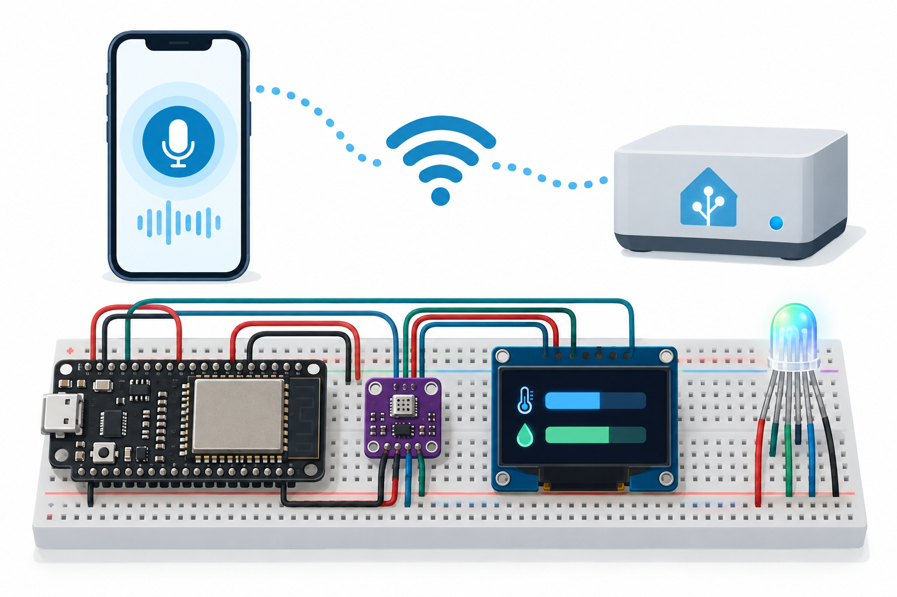

# Smart Entryway Voice Control

Home Assistant's local Assist pipeline controls an ESPHome RGB indicator over Wi-Fi. A BME280 supplies environmental readings, and a 128×64 OLED displays temperature/humidity bars.



## Overview, objectives and features
Learn local speech-to-intent control, native HA device integration, I2C sensing and display scaling. The phone supplies the microphone; ESP32 runs no speech model. No door actuator is controlled.

## Architecture and platform
ESP32 DevKit esp32dev, ESPHome 2026.9.1 ESP-IDF, Home Assistant with a local Whisper/Piper Assist pipeline. [Architecture](docs/architecture.md). The native RGB light entity accepts ordinary HA light intents, colors and brightness.

## BOM quantities
| Quantity | Item |
|---|---|
| 1 | ESP32 DevKit |
| 1 | BME280 3.3V I2C breakout |
| 1 | SSD1306 128×64 3.3V I2C OLED |
| 1 | Common-cathode RGB LED |
| 3 | 330Ω resistors |
| 1 each | Breadboard, USB5V supply/cable |
| 12 | Jumper wires |
| 1 each | HA host capable of local speech inference; phone with Companion app |

## Prerequisites
Python3.12, ESPHome2026.9.1, USB serial access, isolated2.4GHz Wi-Fi and working Home Assistant. Install local speech models on the HA host before offline use. Store network/API secrets privately. ESPHome lab config lacks API encryption; add it privately before wider deployment.

## Exact pin map and circuit/wiring
| ESP32 | Connection |
|---|---|
| GPIO21 | BME SDA and OLED SDA |
| GPIO22 | BME SCL and OLED SCL |
| 3V3 | Both VCC and BME CSB |
| GND | Both GND, BME SDO, RGB cathode |
| GPIO25/26/27 | R/G/B anodes, each through330Ω |
| USB | Regulated5V input |
BME0x76, OLED0x3C. [Precise SVG](docs/circuit-diagram.svg), [wiring](docs/wiring.md). No5V GPIO signals; all I2C pullups to3.3V.

## Assembly
Unplug power. Join grounds, sensor rails and I2C; add three individual LED resistors. Check RGB pin order from its datasheet and OLED supply rating. USB power, inspect scan for0x76/0x3C. Do not substitute a BMP280 expecting humidity.

## Setup and flashing
```sh
python -m pip install esphome==2026.9.1
cp firmware/secrets.example.yaml firmware/secrets.yaml
# Edit ignored secrets.yaml with lab network values.
esphome config firmware/device.yaml
esphome compile firmware/device.yaml
esphome run firmware/device.yaml
```
First flash viaUSB. Add discovered device through HA's ESPHome integration.

## Local voice configuration and usage
Follow [official local Assist setup](https://www.home-assistant.io/voice_control/voice_remote_local_assistant/): install local Whisper and Piper apps/services, configure their Wyoming integrations, create a Voice Assistant using the Home Assistant conversation agent plus those local engines, and select that assistant in the Companion app. Expose the Entryway Indicator light to Assist and give it that alias. Verify manual HA color control before voice.

Speak "turn on Entryway Indicator", "set Entryway Indicator to blue" and "turn off Entryway Indicator". [Command examples](sample-data/commands.json). Recognition depends on language/model and entity naming; actual end-to-end voice testing is not performed. Once models are installed, the selected local pipeline is intended to work without WAN; test this on your hardware.

## Configuration, telemetry/data formats and expected output
BME updates10s; native API exposes temperature°C, humidity%, pressurehPa and RGB light state. OLED updates1s: upper bar maps0–40°C, lower maps0–100%RH, clamped to124 pixels; NaN displays an X. No font downloads are needed. RGB starts off; voice/manual HA changes color/brightness. Serial logs show sensor and API activity. No audio is stored on the board.

## Actual run test results
[Validation results](docs/validation-results.md) records cloud results; physical sensors/display and voice pipeline untested.
```sh
g++ -std=c++17 tests/display_test.cpp -o /tmp/display
/tmp/display
python -m unittest discover -s tests
python tools/validate.py
python tools/validate_completion.py
esphome config firmware/device.yaml
esphome compile firmware/device.yaml
```
CI uses example secrets for compile only.

## Troubleshooting
NoOLED:address0x3C, shared ground, SDA/SCL. Wrongcolor:LED anode order/common-cathode type. Assist saysunknown:entity exposure/alias/language. Slowvoice:local host model capacity. Cloudrequest:check selectedpipeline engines, not firmware. Missinghumidity:correctBME280 part.

## Limitations and domain safety
No onboard microphone, wake-word satellite, lock control, offline autonomous voice or certified alarm. Local HA host and LAN are required. Sensor staleness is not separately diagnosed on the OLED. Voice commands can be misrecognized; keep outputs harmless. No mains, HVAC or security-critical actuator. Protect audio/HA credentials and private API configuration.

## Future work
Add measured latency, stale-sensor display, local speech tests and secured provisioning.

## Contributing and license
Keep pins/display scales and regression tests aligned. See [test plan](docs/test-plan.md). Full [MIT license](LICENSE); contributions use MIT.
